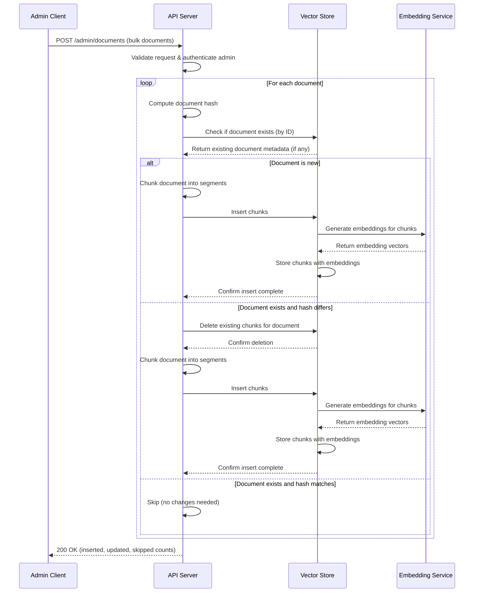
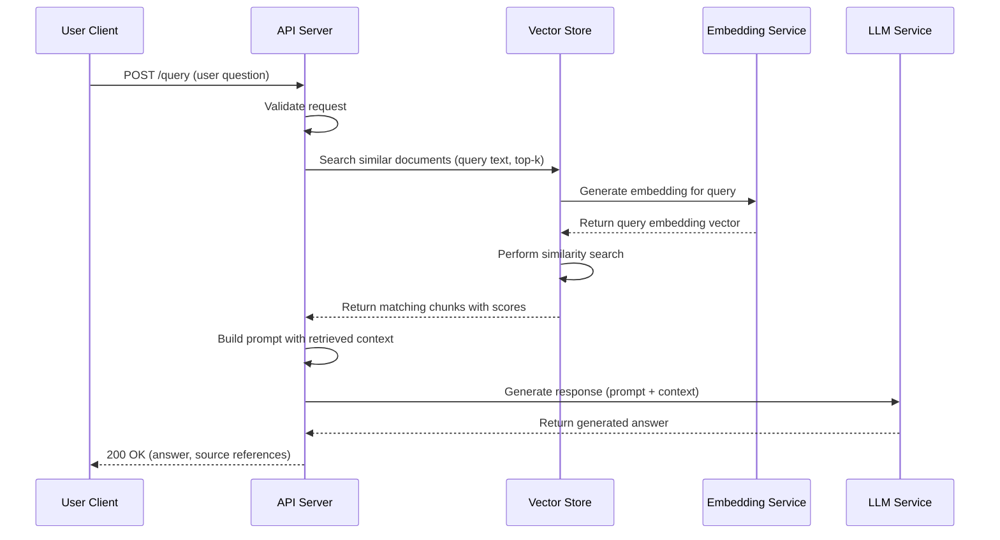
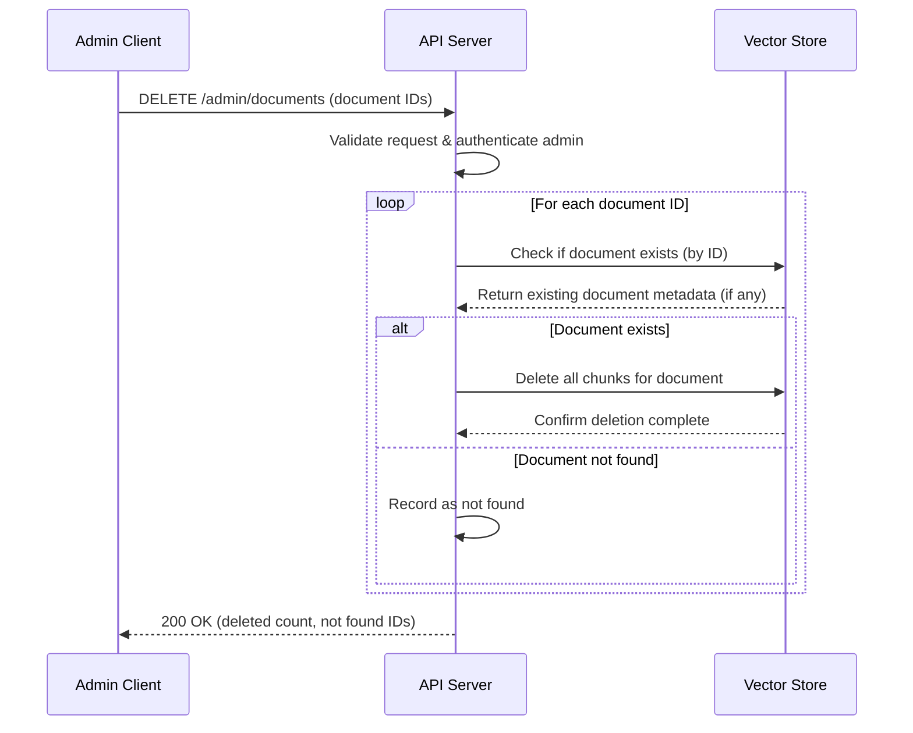

# Architecture

This document describes the architecture of the RAG (Retrieval-Augmented Generation) service.

## Components

- **Admin Client**: Administrative interface for bulk document operations
- **User Client**: End-user interface for querying documents
- **API Server**: Handles requests and orchestrates the RAG pipeline
- **Vector Store**: Stores and retrieves document embeddings, delegates to Embedding Service
- **Embedding Service**: Converts text to vector embeddings (accessed only via Vector Store)
- **LLM Service**: Generates responses using retrieved context

## Process 1: Bulk Document Upsert

An admin user uploads documents to be indexed in the vector store. The system checks for existing documents and only updates those that have been modified.



## Process 2: User Document Query

A user queries the system to retrieve relevant documents and get a generated response.



## Process 3: Document Deletion

An admin user deletes documents and their associated chunks from the vector store.



## REST API

### POST /admin/documents

Bulk upsert documents into the vector store.

**Headers**

| Name | Type | Required | Description |
|------|------|----------|-------------|
| Authorization | string | Yes | Bearer token for admin authentication |
| Content-Type | string | Yes | Must be `application/json` |

**Request Body**

| Field | Type | Required | Description |
|-------|------|----------|-------------|
| documents | array | Yes | List of documents to upsert |
| documents[].id | string | Yes | Unique document identifier |
| documents[].content | string | Yes | Document text content |
| documents[].metadata | object | No | Additional document metadata |

**Example Request**

```json
{
  "documents": [
    {
      "id": "doc-001",
      "content": "This is the full text content of the first document.",
      "metadata": {
        "title": "Introduction",
        "author": "Jane Doe",
        "created_at": "2025-01-15T10:00:00Z"
      }
    },
    {
      "id": "doc-002",
      "content": "This is the full text content of the second document.",
      "metadata": {
        "title": "Chapter 1",
        "author": "Jane Doe"
      }
    }
  ]
}
```

**Responses**

| Status | Description |
|--------|-------------|
| 200 | Documents processed successfully |
| 400 | Invalid request body |
| 401 | Unauthorized - invalid or missing token |
| 500 | Internal server error |

**Example Response (200)**

```json
{
  "inserted": 1,
  "updated": 1,
  "skipped": 0,
  "details": [
    { "id": "doc-001", "status": "inserted", "chunks": 3 },
    { "id": "doc-002", "status": "updated", "chunks": 2 }
  ]
}
```

**Example Response (400)**

```json
{
  "error": "validation_error",
  "message": "Missing required field: documents[0].content"
}
```

---

### POST /query

Query the vector store and generate a response using retrieved context.

**Headers**

| Name | Type | Required | Description |
|------|------|----------|-------------|
| Content-Type | string | Yes | Must be `application/json` |

**Request Body**

| Field | Type | Required | Description |
|-------|------|----------|-------------|
| question | string | Yes | The user's question |
| top_k | integer | No | Number of chunks to retrieve (default: 5) |
| filters | object | No | Metadata filters for retrieval |

**Example Request**

```json
{
  "question": "What are the main topics covered in the introduction?",
  "top_k": 3,
  "filters": {
    "author": "Jane Doe"
  }
}
```

**Responses**

| Status | Description |
|--------|-------------|
| 200 | Query processed successfully |
| 400 | Invalid request body |
| 500 | Internal server error |

**Example Response (200)**

```json
{
  "answer": "The introduction covers three main topics: the project overview, the methodology used, and the expected outcomes.",
  "sources": [
    {
      "document_id": "doc-001",
      "chunk_index": 0,
      "score": 0.92,
      "content": "This document provides a project overview...",
      "metadata": {
        "title": "Introduction",
        "author": "Jane Doe"
      }
    },
    {
      "document_id": "doc-001",
      "chunk_index": 1,
      "score": 0.87,
      "content": "The methodology section describes...",
      "metadata": {
        "title": "Introduction",
        "author": "Jane Doe"
      }
    }
  ]
}
```

**Example Response (400)**

```json
{
  "error": "validation_error",
  "message": "Missing required field: question"
}
```

---

### DELETE /admin/documents

Delete documents and their chunks from the vector store.

**Headers**

| Name | Type | Required | Description |
|------|------|----------|-------------|
| Authorization | string | Yes | Bearer token for admin authentication |
| Content-Type | string | Yes | Must be `application/json` |

**Request Body**

| Field | Type | Required | Description |
|-------|------|----------|-------------|
| document_ids | array | Yes | List of document IDs to delete |

**Example Request**

```json
{
  "document_ids": ["doc-001", "doc-003", "doc-005"]
}
```

**Responses**

| Status | Description |
|--------|-------------|
| 200 | Deletion processed successfully |
| 400 | Invalid request body |
| 401 | Unauthorized - invalid or missing token |
| 500 | Internal server error |

**Example Response (200)**

```json
{
  "deleted": 2,
  "not_found": ["doc-005"]
}
```

**Example Response (400)**

```json
{
  "error": "validation_error",
  "message": "document_ids must be a non-empty array"
}
```
