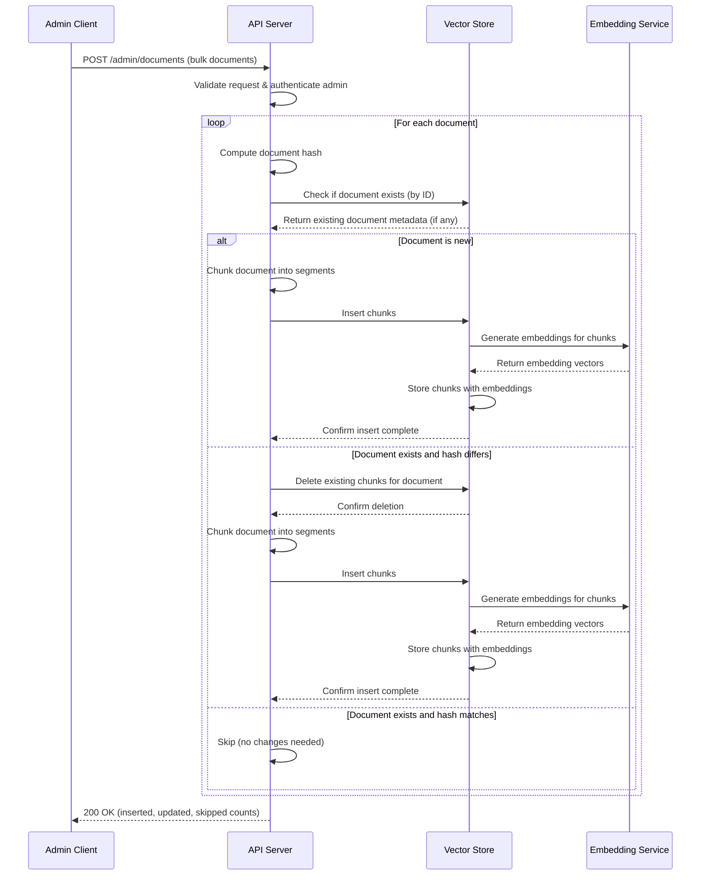
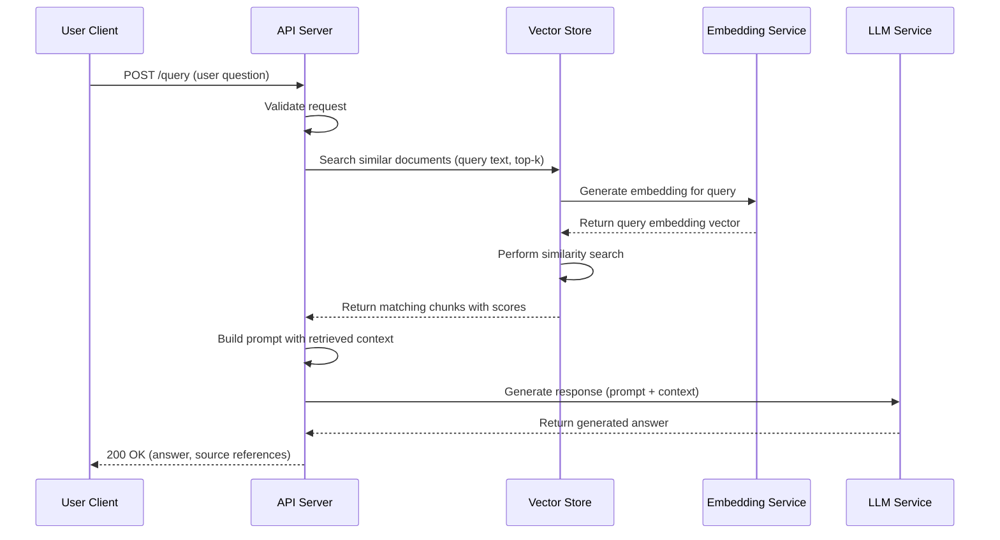
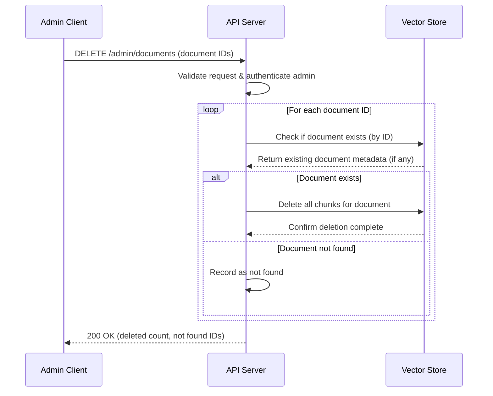

# Architecture

This document describes the architecture of the RAG (Retrieval-Augmented Generation) service.

## Components

- **Admin Client**: Administrative interface for bulk document operations
- **User Client**: End-user interface for querying documents
- **API Server**: Handles requests and orchestrates the RAG pipeline
- **Vector Store**: Stores and retrieves document embeddings, delegates to Embedding Service
- **Embedding Service**: Converts text to vector embeddings (accessed only via Vector Store)
- **LLM Service**: Generates responses using retrieved context

## Process 1: Bulk Document Upsert

An admin user uploads documents to be indexed in the vector store. The system checks for existing documents and only updates those that have been modified.

## Process 2: User Document Query

A user queries the system to retrieve relevant documents and get a generated response.

## Process 3: Document Deletion

An admin user deletes documents and their associated chunks from the vector store.

